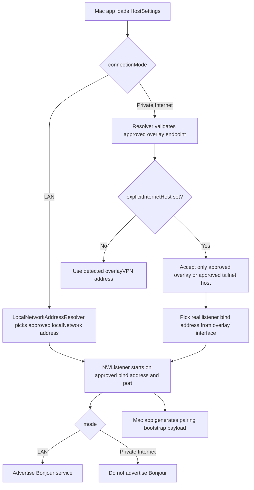
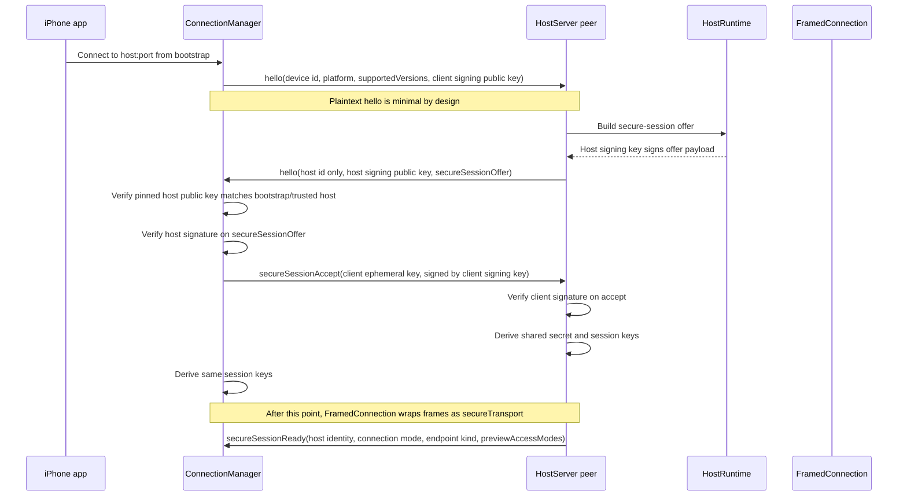
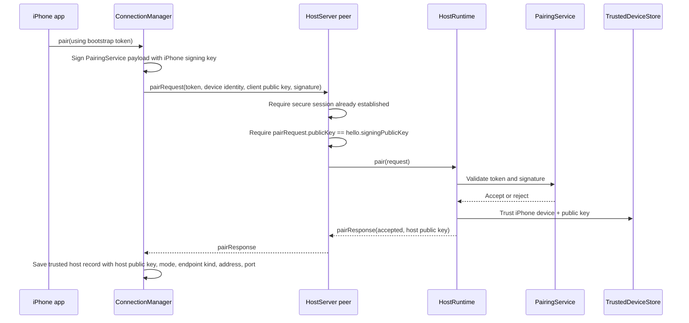
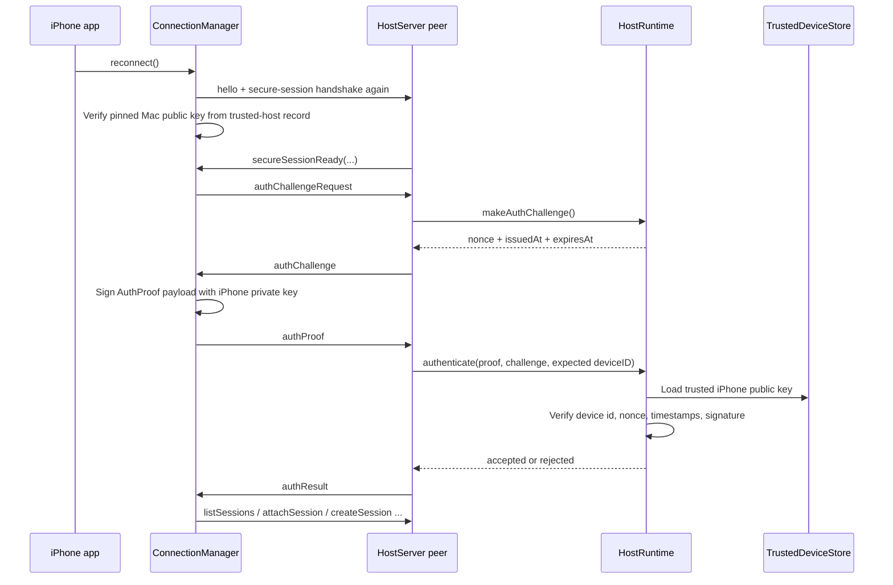
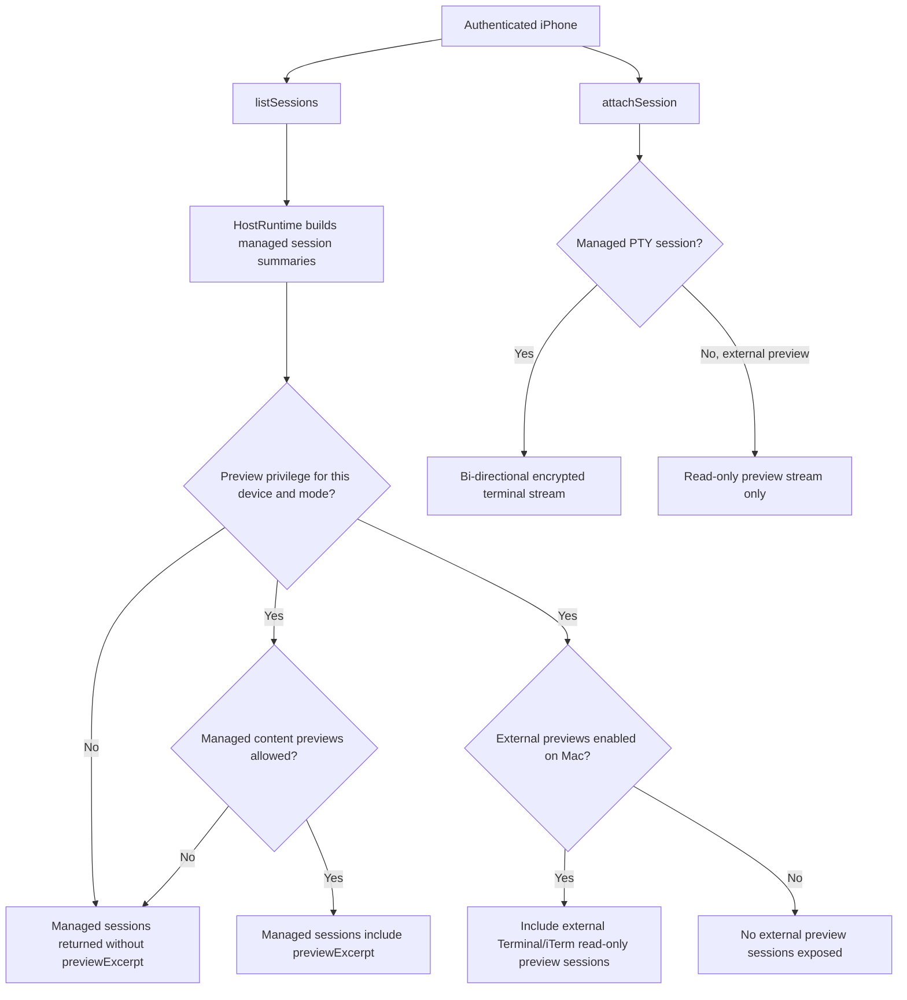
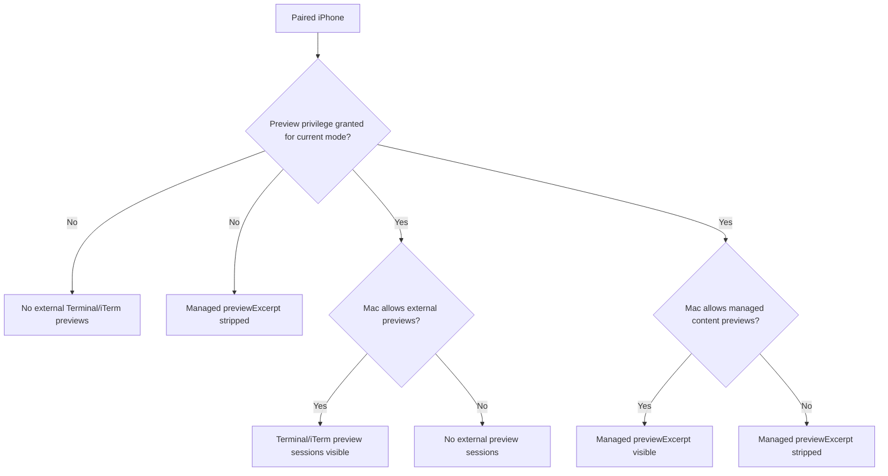
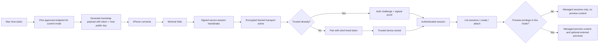

# Connection And Security Flow

This document explains the **implemented** connection flow between the macOS host and the iPhone client.

It is based on the current code in:

- [HostServer.swift](../Sources/APTerminalHost/HostServer.swift)
- [HostRuntime.swift](../Sources/APTerminalHost/HostRuntime.swift)
- [ConnectionManager.swift](../Sources/APTerminalClient/ConnectionManager.swift)
- [FramedConnection.swift](../Sources/APTerminalTransport/FramedConnection.swift)
- [LocalNetworkAddressResolver.swift](../Sources/APTerminalCore/LocalNetworkAddressResolver.swift)
- [HostSettings.swift](../Sources/APTerminalCore/HostSettings.swift)
- [PairingBootstrapPayload.swift](../Sources/APTerminalProtocol/PairingBootstrapPayload.swift)

## Components

- **Mac app**: owns host settings, trust state, pairing token generation, audit log, PTY sessions, and optional external Terminal/iTerm previews.
- **Host listener**: `NWListener` over TCP.
- **Framed transport**: explicit frame codec with heartbeat, idle timeout, frame limits, backpressure limits, and app-layer secure transport.
- **iPhone app**: connects directly to the Mac over LAN or an approved private overlay endpoint.
- **Trust stores**:
  - Mac stores trusted iPhones.
  - iPhone stores trusted Macs.

## Security Model At A Glance

- Pairing is required before a device becomes trusted.
- The iPhone pins the Mac signing public key from the bootstrap payload and later reconnects.
- The Mac binds pairing to the same client signing key used in the secure-session handshake.
- The transport is **TCP underneath**, but after `hello` it upgrades to an **app-layer encrypted secure session**.
- Reconnect requires an explicit challenge and proof signed by the trusted iPhone key.
- Session metadata is only exposed after authentication.
- Preview access is separate from ordinary pairing trust and is enforced per trusted device and per connection mode.
- Bonjour advertisement is used only in `LAN` mode.

## 1. Host Startup And Endpoint Selection

### What is enforced

- `LAN` mode starts only if a private LAN endpoint is available.
- `Private Internet` starts only if an approved overlay endpoint is available.
- A bad `explicitInternetHost` blocks startup.
- In private mode, the app advertises an overlay endpoint to the iPhone but binds to a real local overlay interface address.
- Public/global fallback addresses are treated as warnings and not as approved endpoints for the intended modes.

## 2. Pairing Bootstrap Payload

The QR code or pasted bootstrap payload contains:

- host identity
- host address
- host port
- connection mode
- endpoint kind
- short-lived pairing token
- host signing public key

This is encoded by [PairingBootstrapPayload.swift](../Sources/APTerminalProtocol/PairingBootstrapPayload.swift).

### Why it matters

- The iPhone does not trust an arbitrary host on first connect.
- The bootstrap payload carries the host public key, so the iPhone can pin the Mac identity during the first secure connection.
- Pairing tokens are short-lived and, by default, single-use.

## 3. First Connection And Secure Session Establishment

### What is plaintext vs encrypted

- Plaintext:
  - initial `hello`
  - host reply `hello`
  - secure-session offer and accept
- Encrypted after secure-session activation:
  - `secureSessionReady`
  - pairing
  - auth challenge and proof
  - session list
  - session create, attach, resize, detach, lock
  - terminal input and output bytes

### Security concepts used here

- **Host identity pinning**: the iPhone compares the host signing key against the bootstrap payload or trusted-host record.
- **Signed ephemeral key exchange**: both sides prove possession of their signing keys before accepting the secure session.
- **Derived symmetric keys**: `FramedConnection` encrypts and authenticates subsequent frames.
- **Per-frame sequencing**: secure transport tracks outbound and inbound sequence numbers to reject tampering or replay.

## 4. First-Time Pairing

### Security concepts used here

- Pairing only happens **inside the secure session**.
- The Mac rejects pairing if the key in `pairRequest.publicKey` does not match the key already used in `hello` and `secureSessionAccept`.
- The Mac stores the trusted iPhone key only after token validation succeeds.
- The iPhone stores the trusted Mac record only after it receives an accepted response carrying the host key.

## 5. Reconnect For An Already Trusted iPhone

### Reconnect protections

- The host does not trust the connection just because the secure session exists.
- The host issues a fresh challenge nonce.
- The iPhone must prove possession of the trusted signing key.
- The proof has freshness checks and replay detection.
- If the device was revoked on the Mac, reconnect fails because the trusted device record is gone.

## 6. Session Access And Data Plane

### What the iPhone can do after authentication

- List sessions
- Create managed sessions, subject to launch policy
- Attach to managed sessions
- Send input to managed sessions
- Resize, detach, lock, rename, close managed sessions

### What the iPhone cannot do for external previews

- no input
- no resize
- no rename
- no close from the phone

The host enforces this in `HostRuntime` and `HostServer`, not in the UI alone.

## 7. Preview Authorization

Preview access is intentionally separate from ordinary pairing trust.

### Important implementation details

- Preview privilege is stored per trusted device.
- Preview privilege is also scoped per mode:
  - a device can have preview access for `LAN`
  - and separately for `Private Internet`
- External previews are Apple Events-backed and are activated when the Mac host enables them locally.
- Remote access to those previews still requires device preview privilege.
- Preview use, grant, revoke, and denial are audited without logging terminal content.

## 8. Mode Differences

| Area | LAN | Private Internet |
| --- | --- | --- |
| Approved endpoint | private local network address | approved overlay endpoint |
| Bonjour advertisement | yes | no |
| Typical address | `192.168.x.x`, `10.x.x.x` | overlay/Tailscale-style address or approved tailnet hostname |
| Pairing token lifetime | LAN lifetime | shorter internet lifetime |
| External previews default | enabled | disabled |
| Preview privilege | per device, per mode | per device, per mode |

## 9. Guardrails Implemented In Transport And Host

- Explicit framing, not ad hoc stream parsing.
- Maximum inbound frame size.
- Maximum buffered inbound bytes.
- Terminal-output backpressure limit.
- Heartbeat and idle timeout.
- Request rate limiting for:
  - `hello`
  - `pairRequest`
  - session control
  - session create
  - session attach
- Unauthorized requests are rejected at the host boundary.
- Malformed or oversized frames close the peer.

## 10. Trust And Storage Boundaries

- Long-lived trust keys are stored in the app trust stores.
- Host settings, trusted-host state, and audit files are written with protected local file handling.
- Audit logs include security events such as:
  - connection accepted or denied
  - device paired or revoked
  - auth challenge issued
  - auth proof accepted or rejected
  - preview access granted, revoked, denied, or used
- Audit logs do **not** include terminal transcript content.

## 11. End-To-End Summary

## 12. What This Document Does Not Claim

- It does not claim raw `NWConnection` TLS is used. The implementation uses TCP plus an app-layer secure session.
- It does not claim cloud relay behavior. The current code is direct host-to-phone only.
- It does not claim generic public internet exposure. Private internet mode is implemented as an approved private overlay path.
